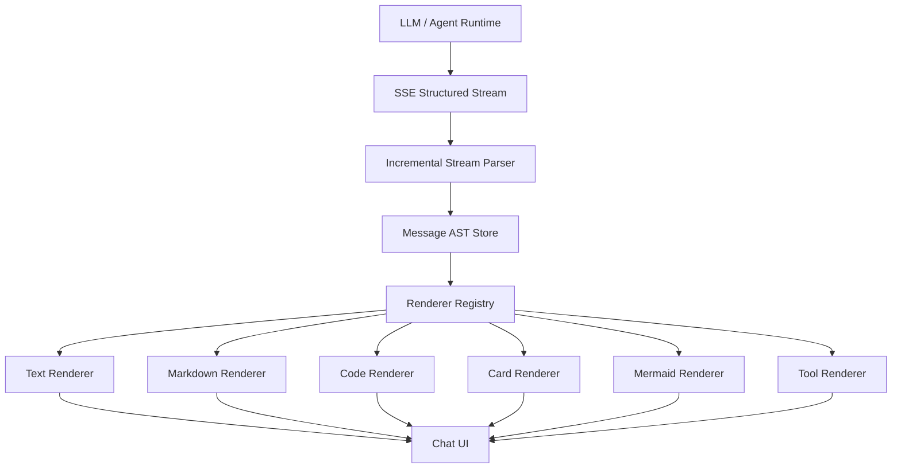
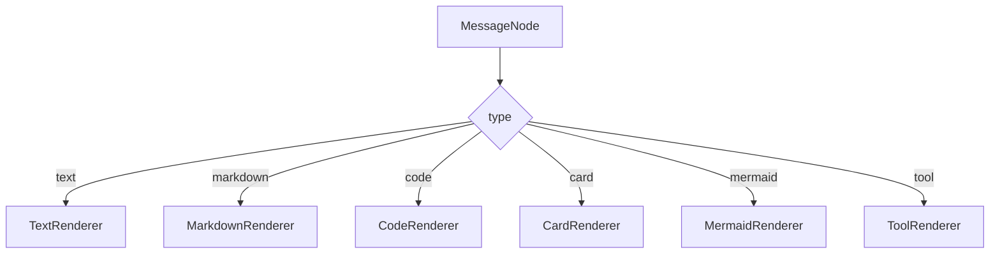
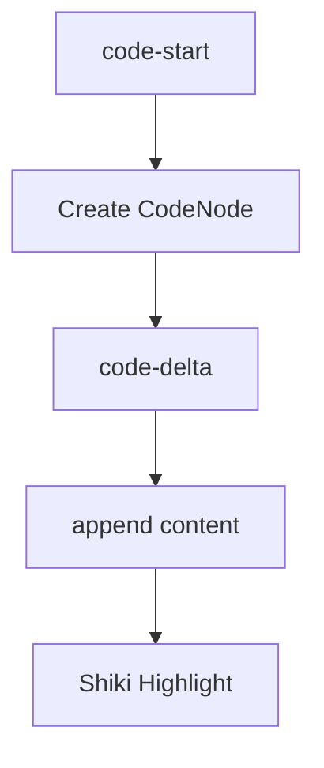
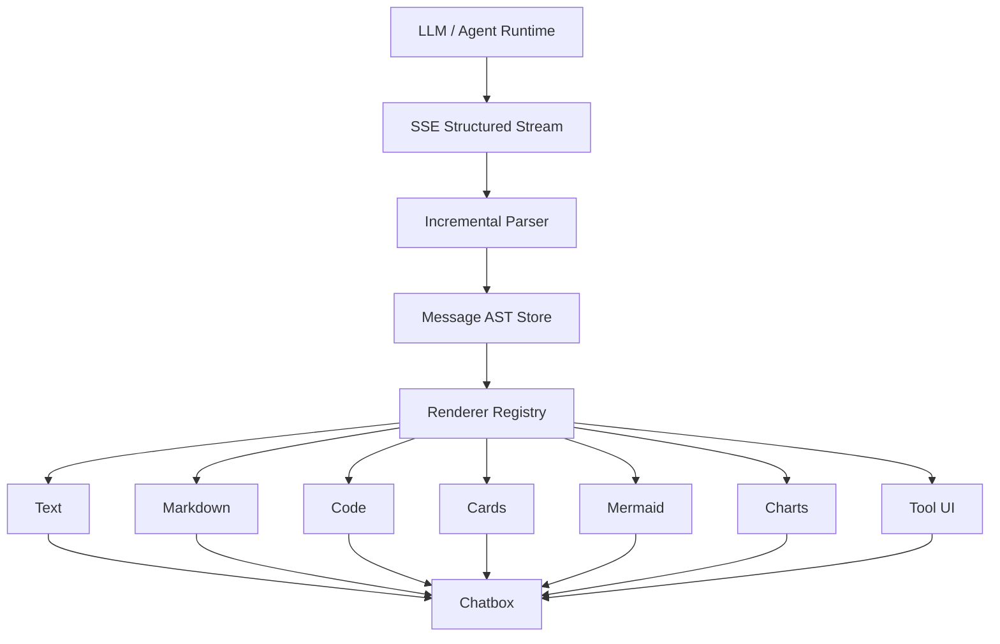

# Chatbox 流式输出渲染架构优化方案（Codex 实施版）

## 项目目标

构建一个类似 [ChatGPT](https://chatgpt.com?utm_source=chatgpt.com) / [Claude](https://claude.ai?utm_source=chatgpt.com) 的现代 AI Chatbox，支持：

* 流式输出（Streaming）
* 多类型消息渲染
* 结构化卡片
* 代码高亮
* Mermaid 流程图
* Tool Calling
* 增量渲染
* 高性能长会话
* Agent/Skills/MCP 扩展

目标效果：

* token 实时输出
* 无明显 UI 卡顿
* 无整块 rerender
* 长对话稳定
* Renderer 可插拔
* 后续支持多模态

---

# 一、核心设计思想

## 不要：

```txt
LLM -> Markdown字符串 -> react-markdown
```

## 要：

```txt
LLM -> Structured Stream -> Message AST -> Renderer
```

即：

# “结构化消息流 + AST渲染”

而不是：

# “Markdown文本渲染”

---

# 二、整体架构



---

# 三、推荐技术栈

## 前端

| 类型             | 推荐                    |
| -------------- | --------------------- |
| UI框架           | React                 |
| 状态管理           | Zustand               |
| Stream         | SSE(EventSource)      |
| Markdown       | remark/react-markdown |
| Code Highlight | Shiki                 |
| Mermaid        | mermaid               |
| 虚拟列表           | react-virtual         |
| 动画             | framer-motion         |

---

# 四、为什么选择 SSE

推荐：

# Server-Sent Events（SSE）

原因：

| 优势                  | 说明                  |
| ------------------- | ------------------- |
| 简单                  | HTTP即可              |
| 浏览器原生支持             | EventSource         |
| AI生态成熟              | OpenAI/Anthropic均采用 |
| nginx友好             | 容易代理                |
| token streaming天然适配 | 非常适合LLM             |

---

# 五、推荐的流式协议

## 不推荐

```txt
纯 token stream
```

例如：

```txt
H
He
Hel
Hell
Hello
```

问题：

* 无结构
* 无法扩展
* 无法支持卡片/tool
* Mermaid困难
* markdown困难

---

# 六、推荐结构化事件流

## 推荐事件结构

```json
{
  "type": "text-delta",
  "id": "node-1",
  "delta": "Hello"
}
```

---

## 代码块开始

```json
{
  "type": "code-start",
  "id": "node-2",
  "language": "typescript"
}
```

---

## 代码块增量

```json
{
  "type": "code-delta",
  "id": "node-2",
  "delta": "const app = express()"
}
```

---

## 卡片消息

```json
{
  "type": "card",
  "cardType": "recipe",
  "props": {
    "title": "番茄炒蛋"
  }
}
```

---

## Mermaid流程图

```json
{
  "type": "mermaid",
  "id": "m1",
  "content": "graph TD A-->B"
}
```

---

# 七、推荐事件类型定义

```ts
type StreamEvent =
  | TextDeltaEvent
  | TextDoneEvent
  | MarkdownDeltaEvent
  | CodeStartEvent
  | CodeDeltaEvent
  | CodeDoneEvent
  | CardEvent
  | MermaidEvent
  | ToolCallEvent
  | ToolResultEvent
  | ErrorEvent
  | FinishEvent
```

---

# 八、核心设计：Message AST

## 非常关键

不要存：

```ts
content: string
```

应该存：

```ts
nodes: MessageNode[]
```

---

# 九、AST 节点设计

```ts
type MessageNode =
  | TextNode
  | MarkdownNode
  | CodeNode
  | CardNode
  | MermaidNode
  | ToolNode
```

---

## TextNode

```ts
interface TextNode {
  type: "text"
  content: string
}
```

---

## CodeNode

```ts
interface CodeNode {
  type: "code"
  language: string
  content: string
}
```

---

## CardNode

```ts
interface CardNode {
  type: "card"
  cardType: string
  props: Record<string, any>
}
```

---

## MermaidNode

```ts
interface MermaidNode {
  type: "mermaid"
  content: string
}
```

---

# 十、消息结构

```ts
interface ChatMessage {
  id: string
  role: "user" | "assistant"
  nodes: MessageNode[]
}
```

---

# 十一、前端状态设计（重要）

## 不要：

```ts
useState([])
```

## 推荐：

```ts
interface StreamStore {
  messages: Record<string, ChatMessage>
}
```

配合：

```ts
Zustand
```

原因：

* 避免全量 rerender
* 更适合增量 patch
* 更适合长会话

---

# 十二、增量渲染核心

## 不要：

```ts
setMessages([...])
```

## 推荐：

```ts
messages[id].nodes[nodeId].content += delta
```

即：

# Node级 patch

而不是：

# Message级 rerender

---

# 十三、Renderer Registry（企业级核心）



---

# 十四、Renderer Factory

```tsx
function Renderer({ node }: { node: MessageNode }) {
  switch (node.type) {
    case "text":
      return <TextRenderer node={node} />

    case "markdown":
      return <MarkdownRenderer node={node} />

    case "code":
      return <CodeRenderer node={node} />

    case "card":
      return <CardRenderer node={node} />

    case "mermaid":
      return <MermaidRenderer node={node} />

    default:
      return null
  }
}
```

---

# 十五、流式代码块渲染

## 推荐流程



---

# 十六、Mermaid流程图优化

## 不要：

````md
```mermaid
graph TD
A-->B
````

````

直接 markdown 全量渲染。

---

## 推荐：

```ts
{
  type: "mermaid",
  content: "graph TD A-->B"
}
````

---

## Mermaid Renderer

```tsx
<MermaidRenderer node={node} />
```

内部：

```ts
mermaid.render()
```

---

# 十七、Mermaid性能优化

必须：

* debounce render
* lazy render
* viewport render
* memoization

否则：

* UI闪烁
* CPU暴涨
* 重绘频繁

---

# 十八、卡片系统（重点）

真正 AI Chatbox 核心：

# “结构化卡片”

---

## 不要：

```md
# 菜谱
- 番茄
- 鸡蛋
```

---

## 推荐：

```json
{
  "type": "card",
  "cardType": "recipe",
  "props": {
    "title": "番茄炒蛋",
    "ingredients": []
  }
}
```

---

# 十九、Card Factory

```tsx
<CardFactory
  type={cardType}
  props={props}
/>
```

---

# 二十、推荐卡片类型

建议支持：

| 卡片类型              | 场景     |
| ----------------- | ------ |
| recipe-card       | 菜谱     |
| schedule-card     | 日程     |
| tool-result-card  | Tool结果 |
| search-card       | 搜索     |
| citation-card     | 引用     |
| product-card      | 商品     |
| image-card        | 图片     |
| code-preview-card | 代码预览   |

---

# 二十一、Markdown Streaming 关键问题

LLM markdown streaming 存在：

| 问题      | 示例       |
| ------- | -------- |
| 半截 bold | `**bold` |
| 半截代码块   | ```ts    |
| 半截链接    | `[a](`   |
| UI闪烁    | 高频parse  |

这是 streaming markdown 的经典问题。 ([OpenAI Developer Community][1])

---

# 二十二、Markdown优化策略

## 推荐：

### 1. buffer机制

不要每 token parse。

例如：

```ts
buffer += delta
```

达到一定条件：

* 空格
* 换行
* chunk size

再 render。

---

## 2. debounce parse

例如：

```ts
100ms
```

---

## 3. 增量 AST

不要：

```txt
每次重新parse全文
```

---

# 二十三、避免 React Streaming 卡顿

## 不要：

```ts
每token setState
```

---

## 推荐：

```ts
requestAnimationFrame
```

或：

```ts
batch update
```

社区最佳实践：

* 分离 streaming buffer
* 只更新最后一个节点
* 虚拟列表
* chunk batching ([Reddit][2])

---

# 二十四、推荐 Streaming Store

```ts
interface StreamingState {
  streamingMessageId?: string
  streamingNodeId?: string
}
```

---

# 二十五、推荐 UI 更新策略

## 流式期间

仅更新：

```txt
最后一个node
```

---

## 完成后

commit：

```txt
history message
```

---

# 二十六、虚拟滚动（必须）

长会话必须：

```txt
react-virtual
```

否则：

* ChatGPT同类长对话会卡
* DOM节点过多
* markdown render过重

---

# 二十七、推荐性能优化

## 必须做

| 优化                             | 必须  |
| ------------------------------ | --- |
| Node级patch                     | YES |
| Virtual List                   | YES |
| Markdown debounce              | YES |
| Mermaid lazy render            | YES |
| Code lazy highlight            | YES |
| requestAnimationFrame batching | YES |

---

# 二十八、安全设计

## 不允许：

```txt
LLM直接输出HTML
```

原因：

* XSS
* script注入
* iframe注入

---

## 推荐：

```txt
LLM -> DSL/AST -> Renderer
```

由前端：

# “白名单渲染”

---

# 二十九、推荐 Agent 输出协议

推荐：

```xml
<message>
  <text>Hello</text>

  <code lang="ts">
    const a = 1
  </code>

  <card type="recipe">
  </card>
</message>
```

或：

```json
{
  "nodes": []
}
```

---

# 三十、未来扩展方向

后续建议支持：

| 功能               | 建议 |
| ---------------- | -- |
| Tool Calling     | 必须 |
| MCP              | 必须 |
| Skills           | 必须 |
| Artifact         | 推荐 |
| 多模态              | 推荐 |
| reasoning stream | 推荐 |
| citations        | 推荐 |
| side panel       | 推荐 |

---

# 三十一、最终推荐架构



---

# 三十二、项目实施优先级

## Phase 1

* SSE
* Text Streaming
* Markdown Renderer
* Zustand Store

---

## Phase 2

* CodeNode
* Shiki
* Virtual List
* Incremental Patch

---

## Phase 3

* Card System
* Renderer Registry
* Tool UI

---

## Phase 4

* Mermaid
* Charts
* Artifact
* Side Panel

---

# 三十三、Codex 实施要求

## Codex 需要完成：

### 基础能力

* React Chatbox
* SSE Client
* Stream Parser
* Zustand Store

---

### Renderer体系

* TextRenderer
* MarkdownRenderer
* CodeRenderer
* CardRenderer
* MermaidRenderer

---

### AST系统

* MessageNode
* ChatMessage
* StreamEvent
* Incremental Patch

---

### 性能优化

* Virtual List
* Debounce
* Lazy Render
* Memoization

---

### 安全要求

* 禁止 raw HTML
* Renderer 白名单
* sanitize markdown

---

# 三十四、最终目标

实现：

# “类似 ChatGPT / Claude / Cursor 的现代 AI Chatbox”

具备：

* 企业级扩展性
* 高性能 Streaming
* 多类型内容渲染
* Agent/Tool/MCP 兼容
* 长会话稳定性
* 多模态扩展能力

---

# 参考资料

* [Chrome Streaming Rendering Best Practices](https://developer.chrome.com/docs/ai/render-llm-responses?utm_source=chatgpt.com) ([Chrome for Developers][3])
* [Streaming Markdown Discussion(OpenAI)](https://community.openai.com/t/streaming-markdown-or-other-formatted-text/510268?utm_source=chatgpt.com) ([OpenAI Developer Community][1])
* [How ChatGPT Streams Smoothly (React Discussion)](https://www.reddit.com/r/reactjs/comments/1nh05xb/how_does_chatgpt_stream_text_smoothly_without/?utm_source=chatgpt.com) ([Reddit][2])
* [Performant AI Markdown Renderer](https://tigerabrodi.blog/how-to-build-a-performant-ai-markdown-renderer?utm_source=chatgpt.com) ([Tiger's Place][4])
* [Production Streaming Guide (FastAPI + React)](https://ranjankumar.in/building-chatgpt-style-streaming-in-react-fastapi-next-js-production-guide?utm_source=chatgpt.com) ([ranjankumar.in][5])

[1]: https://community.openai.com/t/streaming-markdown-or-other-formatted-text/510268?utm_source=chatgpt.com "Streaming Markdown or Other Formatted Text - API"
[2]: https://www.reddit.com/r/reactjs/comments/1nh05xb/how_does_chatgpt_stream_text_smoothly_without/?utm_source=chatgpt.com "How does ChatGPT stream text smoothly without React UI ..."
[3]: https://developer.chrome.com/docs/ai/render-llm-responses?utm_source=chatgpt.com "Best practices to render streamed LLM responses"
[4]: https://tigerabrodi.blog/how-to-build-a-performant-ai-markdown-renderer?utm_source=chatgpt.com "How To Build a Performant AI Markdown Renderer"
[5]: https://ranjankumar.in/building-chatgpt-style-streaming-in-react-fastapi-next-js-production-guide?utm_source=chatgpt.com "Building ChatGPT-Style Streaming in React: FastAPI + Next.js ..."
